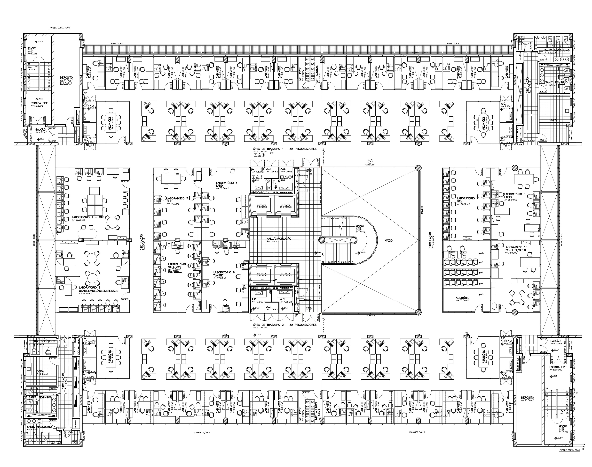
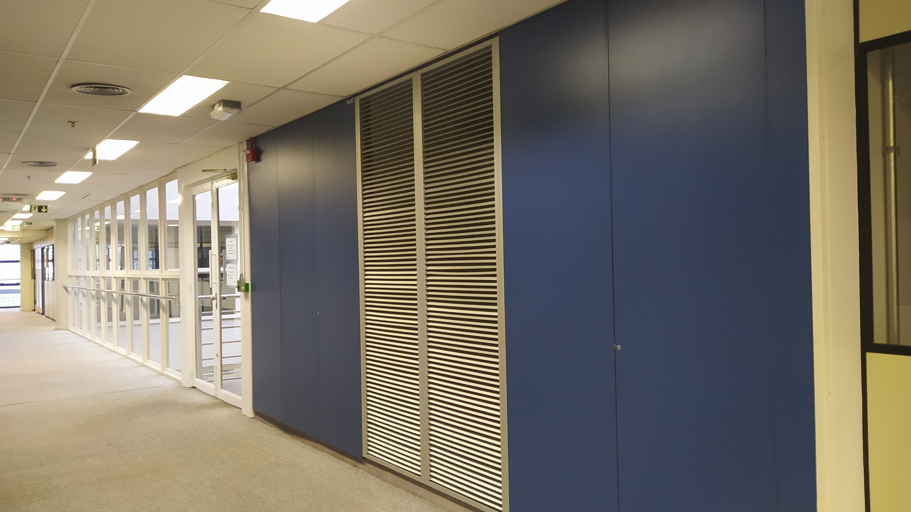
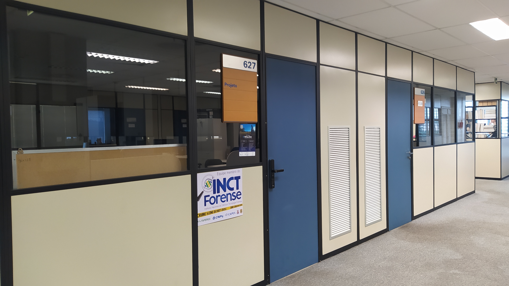
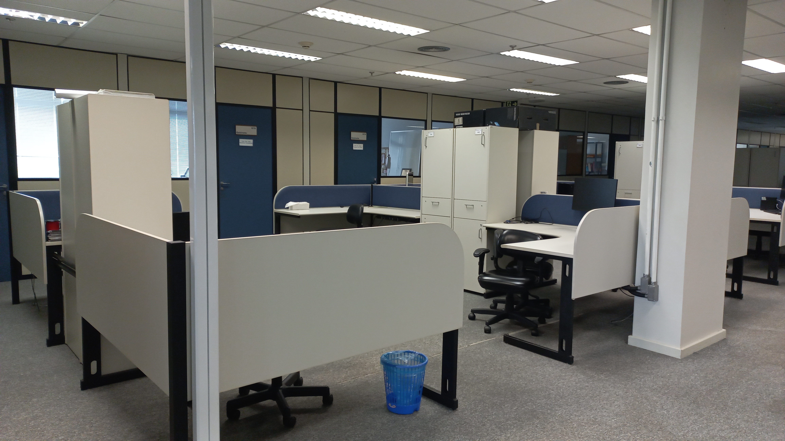
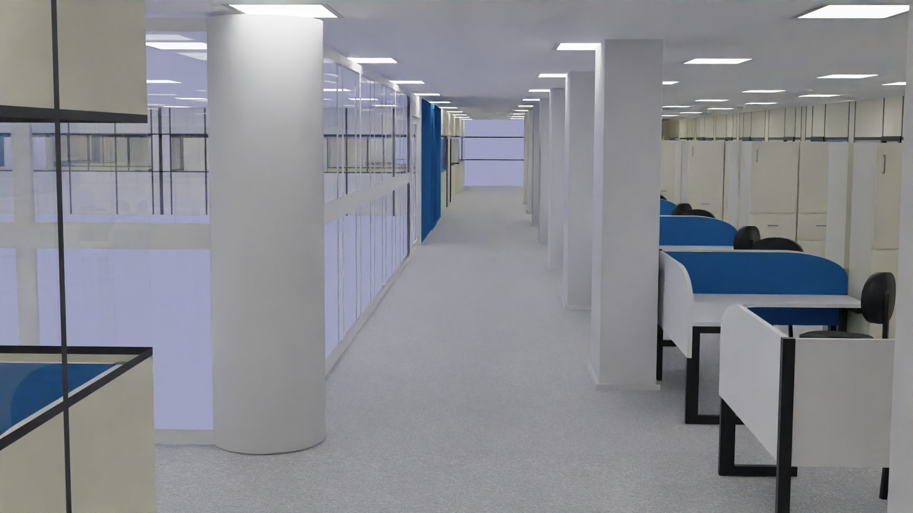
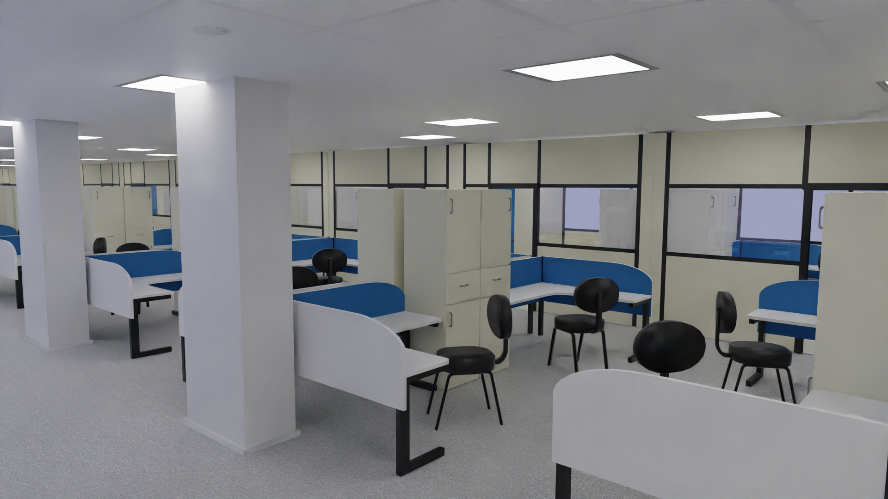
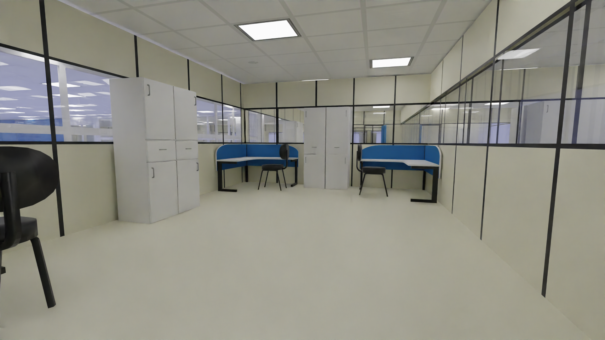

# Modelo 3D do 6° andar do prédio 32 da PUCRS

<h3>Este é um projeto autoral de modelagem 3D e realidade virtual feito a partir da planta baixa do 6° andar do prédio 32 (Escola Politécnica) da PUCRS:</h3>

<h3>Imagens reais do local:</h3>

<h3>Resultados da modelagem no Blender:</h3>

<h3>Softwares utilizados:</h3>

- Blender (para modelagem)
- Unity (para navegação)

<h3>Especificações do projeto no Blender:</h3>

- Objetos: 420
- Vértices: 127.409
- Arestas: 217.206
- Faces: 94.341
- Triângulos: 241.012

<h3>Especificações do projeto na Unity:</h3>

- Os scripts foram escritos em C# com a ajuda do colega Vinícius C. Teixeira

<a href="https://www.youtube.com/watch?v=9UrBAzpAPdE">Clique aqui para ver o vídeo da navageção em VR</a>

